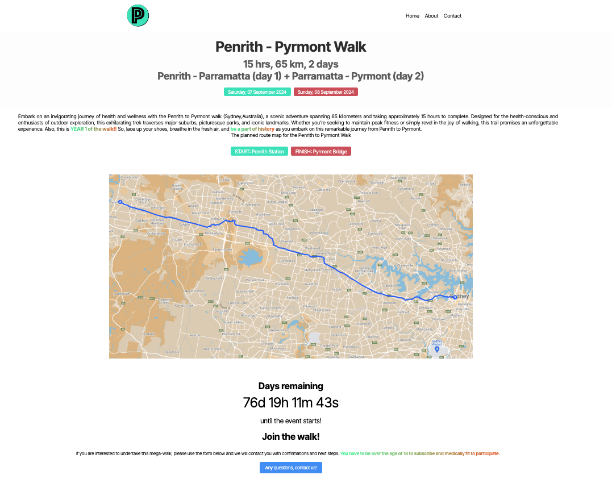

# Penrith Pyrmont Walk

# About
I launched a marathon walk in 21 June 2024! A mega-walk from Penrith to Pyrmont, 2 cities in Sydney, Australia. As a walking enthusiast and to practice my web design skills too, I launched this website and initiative.

# Tech stack
It took me a week to get it all coded, designed and deployed. I cloned my own boilerplate/template which you can find here: https://github.com/emanoj1/boilerplate-react-node-js  
The tech stack: React, NodeJS, JavaScript, HTML/CSS.  
Newsletter widget: ConvertKit  
Domain name registered through the fantastic team at [VentraIP Australia!](https://getonline.vip/kDth4mWQ) (_refer-a-friend link_)  
Deployed on [Netlify](https://netlify.com).  
Logo: Designed by me on Affinity Designer!  
Photos: Unsplash  
Art: The couple walking on the contact page - I drew that!  
Content: I wrote all of that too!  